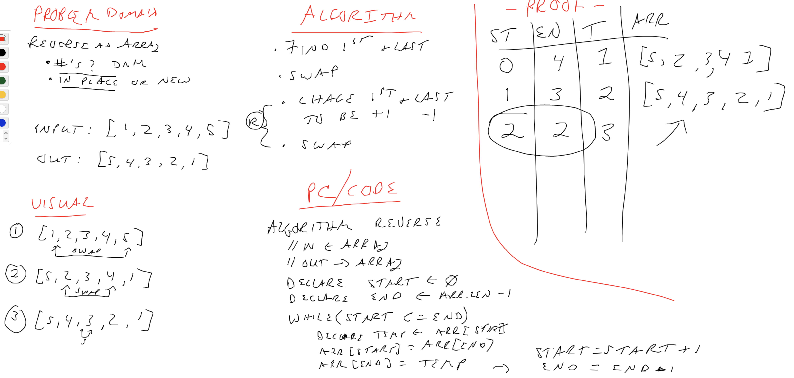

# Reverse an Array

Code Challenge 01 - Reverse an array

## Challenge
<!-- Description of the challenge -->
Take an array and reverse it.

- In Place

## Approach & Efficiency

- Iterate the array, noting the start and end
- Swap them
- Move each of them in 1 place
  - Continue to swap
- When at the middle, stop

## Solution
<!-- Embedded whiteboard image -->

