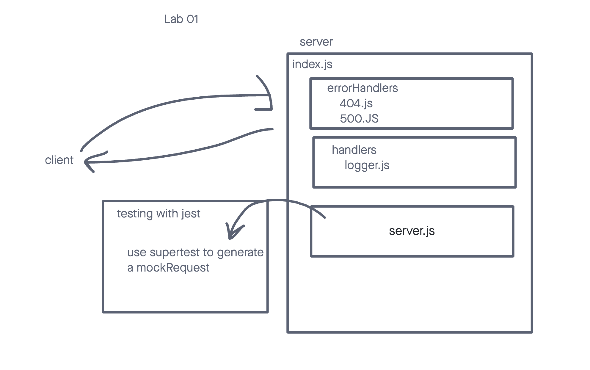

# LAB - Class 01

## Project: Server Deployment Practice

### Author: Ryan Gallaway

### Problem Domain  

Basic API Server where we write some middleware and practice deployment

### Links and Resources

- [GitHub Actions ci/cd](http://xyz.com) 
- Dev [back-end server url](https://d51-practice.onrender.com) 
- Prod [back-end server url](enterYourUrl.xyz) 

### Setup

#### `.env` requirements (where applicable)

not necessary for this lab, wait for tomorrow

#### How to initialize/run your application (where applicable)

- e.g. `npm start`

#### How to use your library (where applicable)

#### Features / Routes

- Feature One: Deploy Dev

#### Tests

fill this in as you see fit
- How do you run tests?
- Any tests of note?
- Describe any tests that you did not complete, skipped, etc

#### UML

