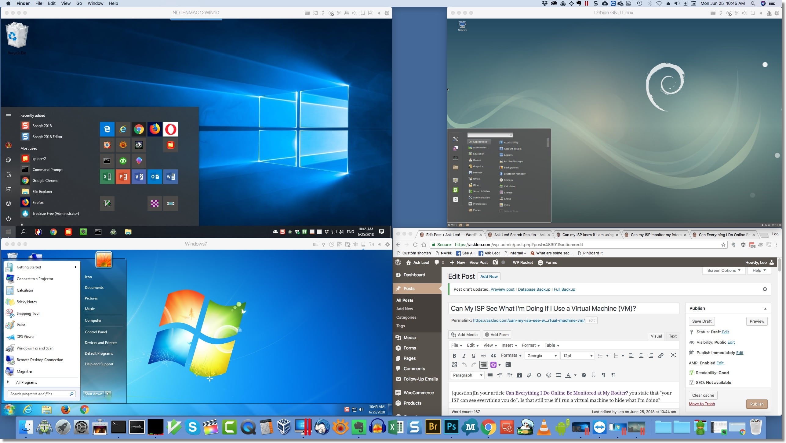
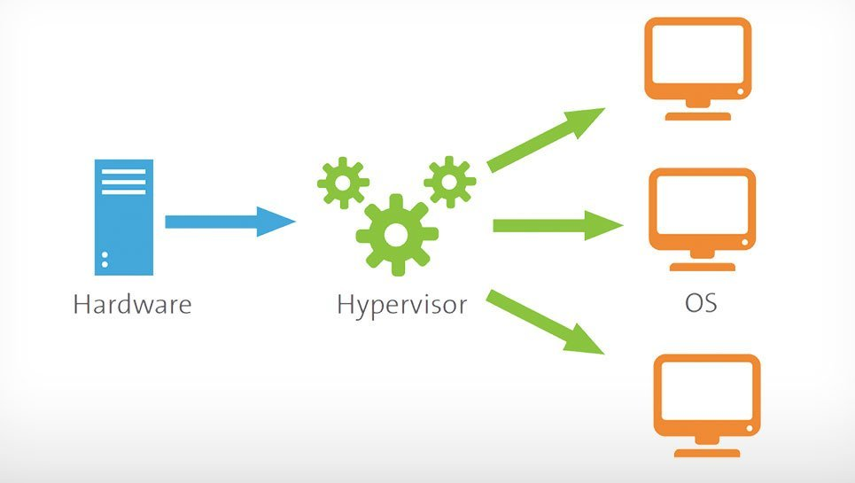
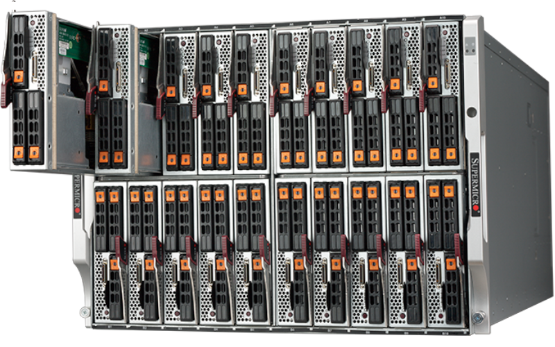
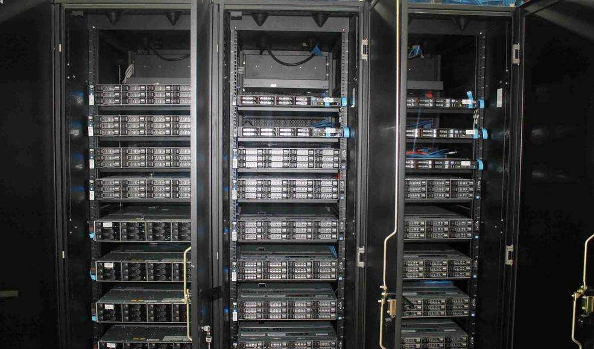
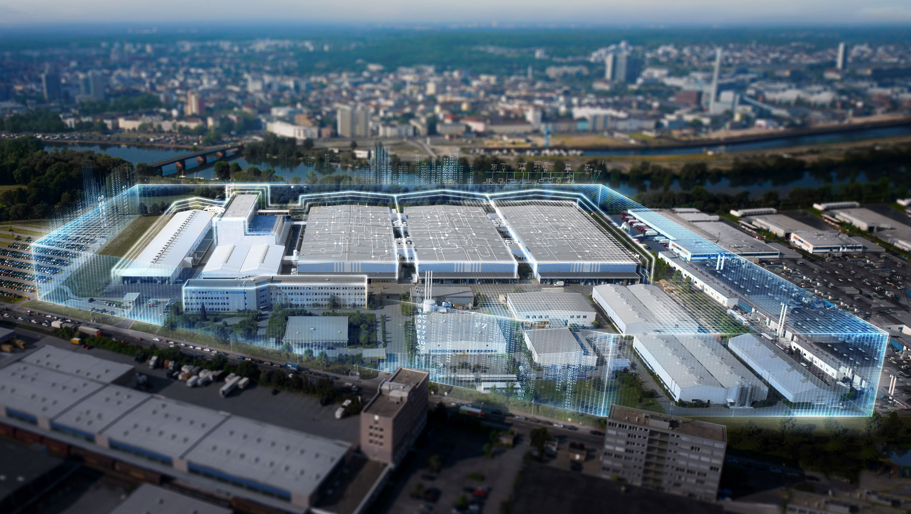
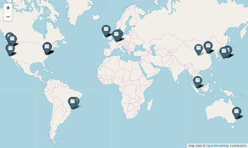

# AWS

## Whiteboard

[Today's Freehand](https://projects.invisionapp.com/freehand/document/Y1tMn7EN8) 

## Presentations:  Final Event Lab

## Where We've Been

1. RESTful HTTP web services with Express and Node
1. Database management:  RESTful CRUD capability
1. Authentication and Authorization with ACL
1. Event Driven programs with the Observer Pattern

## Cloud Computing

10 years ago...  this was totally a thing:  On-site servers that required a lot of diverse maintenance

- ## How (30 min)
  - Many VMs (Virtual Machine)  can run on one physical machine
    
  - Hypervisor software manages and scales these as needed
    
  - A Blade Cluster has up to 32 Slots each with up to 4 computers (each of which is 10x more powerful than your laptop), capable running hundreds of VMs on each
    
  - Blade Clusters live in racks that can generally hold 4-6 Clusters
    
  - Server Farms hold many, many racks
    
  - Server farms are huge -- many football fields in size, and many (many) floors deep
    
  - And they're all over the world. Millions of servers, Billions of VMs
    
