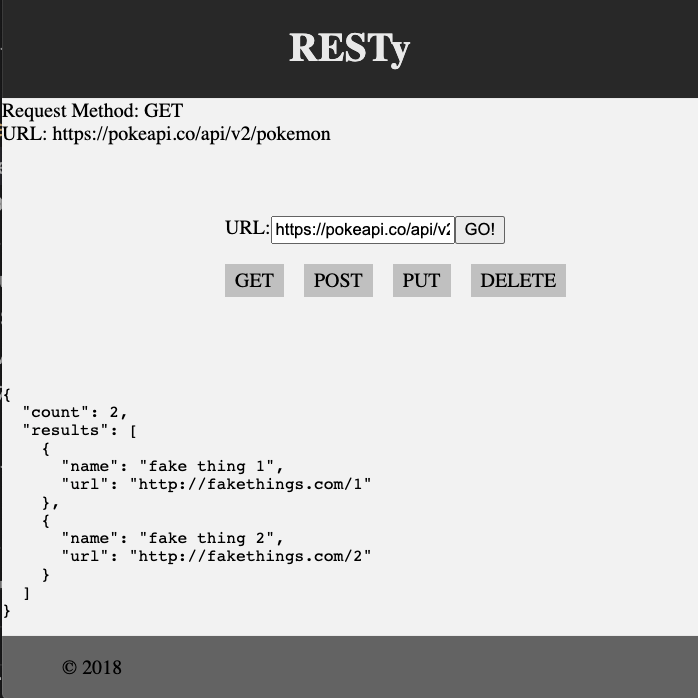

# LAB - Component Based UI

**RESTy Phase 1:** Begin work on the RESTy API testing application.

## Before you begin

Refer to *Getting Started*  in the [lab submission instructions](../../../reference/submission-instructions/labs/README.md) for complete setup, configuration, deployment, and submission instructions.

Create a UML diagram of the **RESTy** system on a whiteboard before you start.

1. Use Create React App (CRA) to create a new application named `resty`.
1. Delete the existing `src` directory.
1. Paste in the `src` directory from the `lab/starter-code`.
1. Run `npm install uuid sass`.
1. `npm start` and confirm that the application loads in the browser.
1. Create an **EMPTY** GitHub Repository named `resty`.
1. Follow GitHub instructions labeled "…or push an existing repository from the command line".
1. Note: after completing the above step, CRA starter code will have been pushed to your GitHub Repo.
1. Immediately `ACP` after adding your newly created repo to GitHub; giving you the option to rollback changes to the base starter code if necessary.
1. Create and work in a new branch for today called `base`. 

## Business Requirements

Refer to the [RESTy System Overview](../../apps-and-libraries/resty/README.md) for a complete review of the application, including Business and Technical requirements along with the development roadmap.

## Phase 1 Requirements

Today, we begin the first of a 4-Phase build of the RESTy application, written in React. In this first phase, our goal is to setup the basic scaffolding of the application, with intent being to add more functionality to the system as we go. This initial build sets up the file structure so that we can progressively build this application in a scalable manner.



## Technical Requirements / Notes

> The application, as written by our development team was done using class components as a proof of concept. In order to go to production, we're going to have to convert this to an application written using React function components so that our foundation is both stable and high performing.

Refactor the RESTy application as follows:

1. Convert all child components of `<App />` from classes to functions.
    - The `<App />` component serves as the container for all sub-components of this application.
    - Leave this component as a Class.
    - Make sure all base styles for `<App />` are included in a `.scss` imported within the `App.jsx` file.
    - Ensure that the `<Header />`, `<Footer />`, `<Results />` and `<Form />` components are imported using ES6 `import` syntax.

1. Use `.scss` files to style each component.
   - Each of the components use their own `.scss` file for styling.

1. Core application functionality should remain unchanged.
   - The `<Form />` component should:
     - Call a function `onSubmit()` that updates the `<App />` component via a function sent down as a prop so that the app can process the form values.
   - The `<Results />` component should show mock API results.

## Proposed File Structure

In this proposal:
- Utilize [Airbnb React/JSX Style Guide](https://airbnb.io/javascript/react/) conventions.
- Unit tests are placed in the component directory (testing one file only).
- Integration tests are placed in the `__tests__` directory (testing more than one file).

```text
├── .github
│   ├── workflows
│   │   └── node.yml
├── public
├── src
│   ├── __tests__
│   │   │   └── App.test.jsx (integration test)
│   ├── Components
│   │   ├── Footer
│   │   │   ├── Footer.scss
│   │   │   ├── Footer.test.jsx (unit test)
│   │   │   └── index.jsx
│   │   ├── Form
│   │   │   ├── Form.scss
│   │   │   ├── Form.test.jsx 
│   │   │   └── index.jsx
│   │   ├── Header
│   │   │   ├── Header.scss
│   │   │   ├── Header.test.jsx 
│   │   │   └── index.jsx
│   │   └── Results
│   │       ├── index.jsx
│   │       ├── Results.scss
│   │       └── Results.test.jsx
│   ├── App.jsx
│   ├── App.scss
│   └── index.js
├── .gitignore
├── package-lock.json
├── package.json
└── README.md
```

## Testing

NOTE: For this assignment, **testing is not required**.

## Stretch Goal

Attempt Testing!
- Utilize the React Testing Library framework installed with CRA.
- Assert that components render elements with language on page load.
- Import `{ fireEvent, render, screen }` from the React Testing Library to confirm behavior when change and/or click events occur.  See [Documentation](https://testing-library.com/docs/react-testing-library/cheatsheet) as necessary. Examples will soon be given in lecture. 

## Assignment Submission Instructions

Refer to the the [Submitting React Apps Lab Submission Instructions](../../../reference/submission-instructions/labs/react-apps.md) for the complete lab submission process and expectations.
