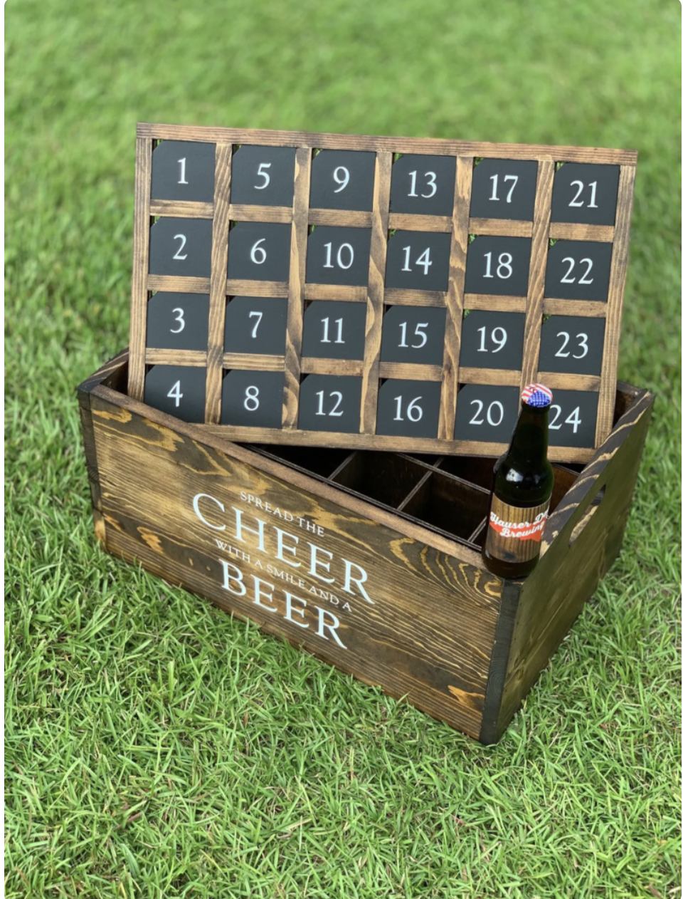

# Hashmaps

### Visualization

> want something from a specific "bucket" grab it by number in the above example

## Review

### Linked List

Why would we use a linked list?
- Linear Storage System
- browse forward possibly (backward)
- want to store some information and have little or no rules about insertion or removal

### Stack or Queue

Why would we use a stack or a queue
- linear, but perhaps we need FIFO or LIFO/FILO behavior

### Binary Tree

Why would we use a binary tree?
- hierarchical data use
- file structure
- DOM (k-ary tree)

### Binary Search Tree

Why use a BST?
- efficiency in sorting:  we cut the number of our options in half at every step, so we get Big O of time:  O(log n);

n = 10 -> Big O time O(n)  things 10 times.  
n = 10 -> Big O time O(log n)  3 times (5, 2.5, 1.25)
n = 100 -> Big O time O(log n)  6 times (50, 25, 12.5, 6, 3, 1.50)

## Hash Table

> You may hear HashTable, HashMap, HashSet, Map, Set

> Map and Set are JavaScript's native "hashTables"

Why we use a Hash Table?
- store some data - of course - it's a data structure
- FAST LOOKUP:  0(1) lookup!!!

### Terminology

- Key: (will be hashed) - this will be  a primitive(datatype not a data structure) in today's implementation
- Hashing: pass in a string, return that hashed string as a number.  the number will translate to a specific or "deterministic" place within our structure (HashTable)
- Collision: if a key hashes to the SAME location in our structure, we call that a collision

> the better the hash, the less likely we are to have collisions!  using ascii sums, getting the same number is not all that uncommon

get ASCII sum of Ryan:  410

in JavaScript, we can hash objects - UUID sort of hash.  collisions will be ACTUAL duplicates
