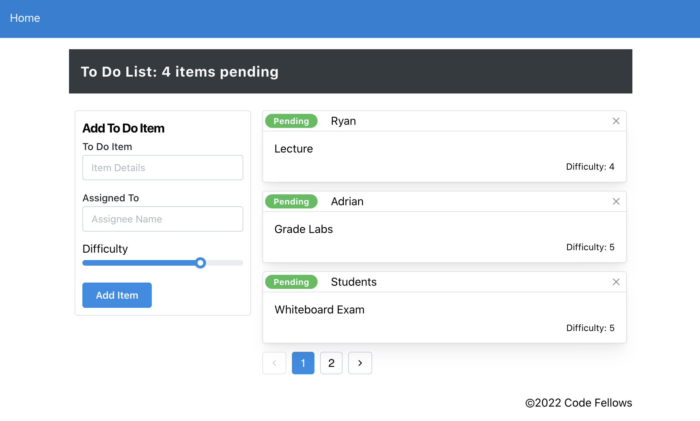

# LAB - Context API

**To Do List Manager Phase 1:** Incorporate configuration settings to the application.

Currently, a user can add todo tasks to the proof-of-life starter application. In this phase, we will add hard-wired, default context settings to the application so that the user can view three incomplete todo tasks.  In addition, the user will have the option of viewing any additional incomplete tasks by using pagination functionality.

## Before you begin

Refer to *Getting Started*  in the [lab submission instructions](https://codefellows.github.io/code-401-javascript-guide/reference/submission-instructions/labs/) for complete setup, configuration, deployment, and submission instructions.

1. Use Create React App (CRA) to create a new application named `todo-app`.
1. Delete the existing `src` directory.
1. Paste in the `src` directory from the `lab/starter-code`.
1. Run `npm install uuid sass`.
1. `npm start` and confirm that the application loads in the browser.
1. Create an **EMPTY** GitHub Repository named `todo-app`.
1. Follow GitHub instructions labeled "…or push an existing repository from the command line".
1. Note: after completeing the above step, CRA starter code will have been pushed to your GitHub Repo.
1. Immediately `ACP` after adding your newly created repo to GitHub; this will add the starter-code to your repo and give you the option to rollback changes to the base starter code if necessary.
1. Create and work in a new branch for today called `context-settings`.  

## Business Requirements

Refer to the [To Do System Overview](../../apps-and-libraries/todo/README.md) for a complete review of the application, including Business and Technical requirements along with the development road map.

## Learning Outcomes

- Learn React context functionality and gain overall React fluency.
- Gain provicency in reading documentation by using a new component library.
- Practice JavaScript array manipulation by implementing pagination.
- Gain React testing fluency.

## Phase 1 Requirements

In Phase 1, we're going to perform some refactoring of a Todo application built by another team. This application mixes application state and user settings at the top level and passes things around. It was a good proof of concept, but we need to make this production ready.

- Create a Detailed UML.
- Properly modularize the application into separate components, note the **proposed** file structure below.
- Implement the Context API to make some basic application settings available to components.
  - Show three items by default.
  - Hide completed items by default.
  - Add the sort word 'difficulty' by default.
- Style the application using the [Mantine Component API](https://mantine.dev/pages/getting-started/){target:_blank}.
  - NOTE: The expectation to style this entire component in one day is likely unrealistic.  The recommendation is to implement the required functionality, then systematically begin styling with Mantine.  Match the comp image(s) as closely as possible. 80% of the design work will likely take 20% of your time. By the end of the week, being mostly there with style is the goal! 



## Technical Requirements / Notes

> Create a settings Context component that can define how our components should display elements to the User.

1. Implement the React `context` API for defining `settings` across the entire application.
   - Create React Context for managing application display settings and provide this at the application level.
   - Add the following defaults to the context provider's state, they will not be changeable in this lab.
     - Display three items. 
     - Hide completed items using a boolean. 
     - Define "difficulty" as a default sort word to *optionally* use in the stretch goal.

1. Consume and utilize `context` values throughout your components.
   - Show a maximum of three items per screen by default in the `<List />` component.
   - Use the Mantine `<Pagination />` component to allow users to navigate a list of items.
   - Hide completed items in the list by default (the ability to show will be added in a later lab).

### Pagination Notes:

- Only display the first `n` items in the list, where `n` is the default number three from your settings context.
  - If you have more than `n` items in the list, the `<Pagination />` component will add a button that, when clicked, will replace the list with the next `n`. items in the list.
  - the `<Pagination />` component will manage the "previous" and "next" buttons upon correct implementation.

## Proposed File Structure

In this proposal:
- Utilize [Airbnb React/JSX Style Guide](https://airbnb.io/javascript/react/) conventions.
- unit tests are placed in the component directory (testing one file only).
- integration tests are placed in the `__tests__` directory (testing more than one file).

```text
├── .github
│   ├── workflows
│   │   └── node.yml
├── public
├── src
│   ├── __tests__
│   │   ├── App.test.jsx (integration test)
│   ├── Components
│   │   ├── Footer
│   │   │   └── index.jsx
│   │   ├── Header
│   │   │   └── index.jsx
│   │   ├── List
│   │   │   └── index.jsx
│   │   ├── Todo
│   │   │   ├── index.jsx
│   │   │   └── styles.scss  
│   ├── Context
│   │   ├── Settings
│   │   │   ├── index.jsx
│   │   │   └── Settings.test.jsx (unit test)
│   ├── hooks
│   │   ├── form.js
│   │   └── styles.js (optional)
│   ├── App.jsx
│   └── index.js
├── .gitignore
├── package-lock.json
├── package.json
└── README.md
```

## Stretch Goals

- Sort the items based on any of the keys (i.e. difficulty).
- In your Context component, read the settings in from an object in Local Storage and use that as the initial state.

## Testing

- Tests should assert all behavioral functionality.
- Do a deep mount of the app, and set tests to make assertions on the child components that consume context from the Provider.
  - Can they see context?

## Documentation

- Describe how global state is consumed by the components.
- Describe the operation of the hook: `useForm()`.

## Assignment Submission Instructions

Refer to the the [Submitting React Apps Lab Submission Instructions](https://codefellows.github.io/code-401-javascript-guide/reference/submission-instructions/labs/react-apps.html) for the complete lab submission process and expectations.
